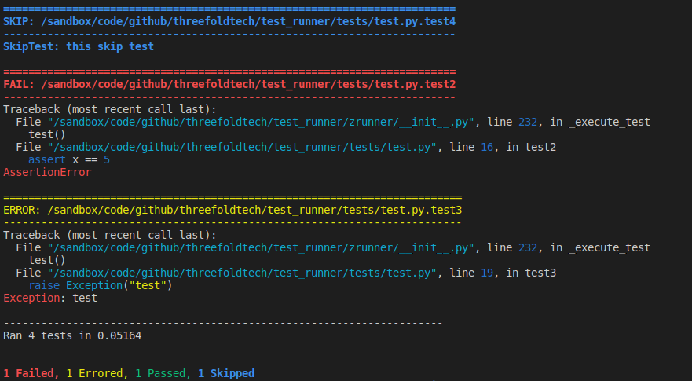

# ZRunner

It's a testing framework and a runner.

## Installation

```bash
poetry install
```

## Configure Tests

test files and test functions should include the word `test`.

### Helpers

#### before

This method runs before each test.

#### after

This method runs after each test.

#### before_all

This method runs once before running the tests.

#### after_all

This method runs once after running the tests.

## Run Tests

```bash
poetry shell
zrunner <tests path>
```

Check `zrunner --help` for more running options

## Run Summary


